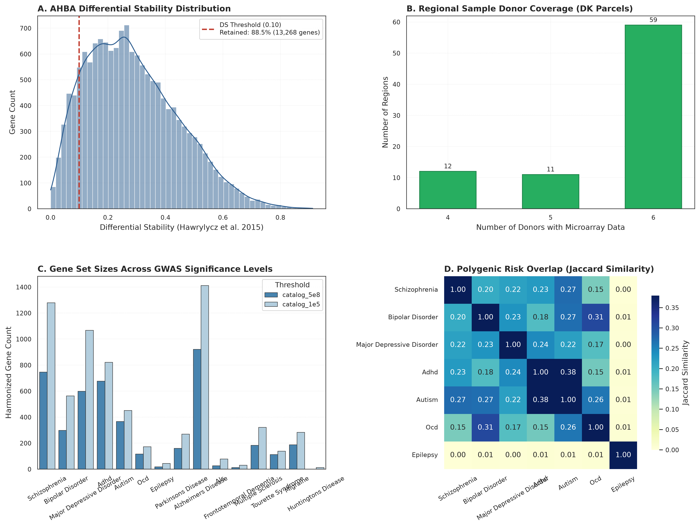
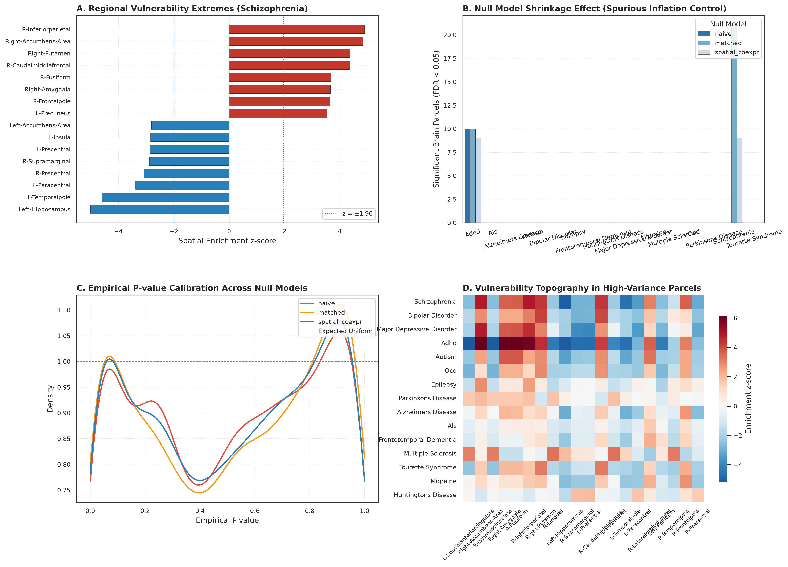
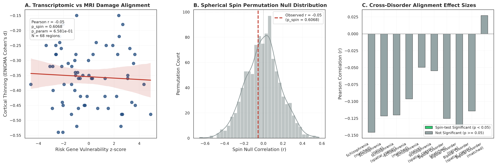
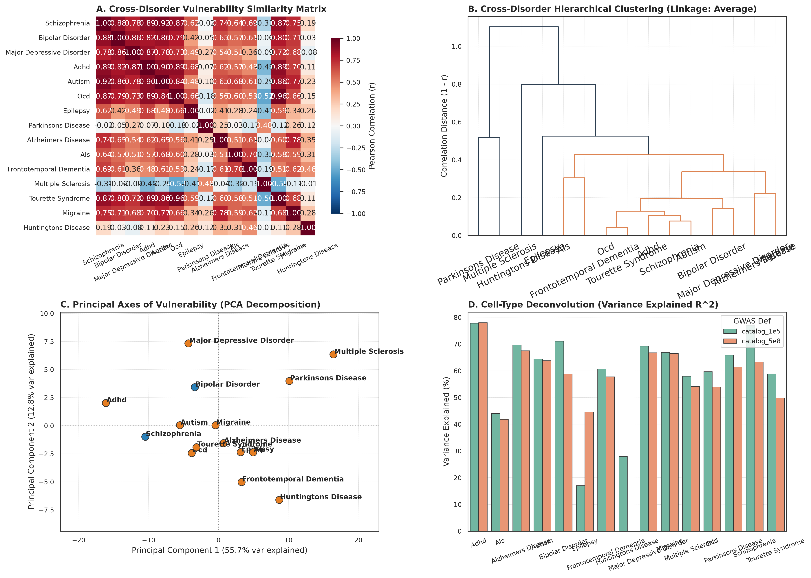
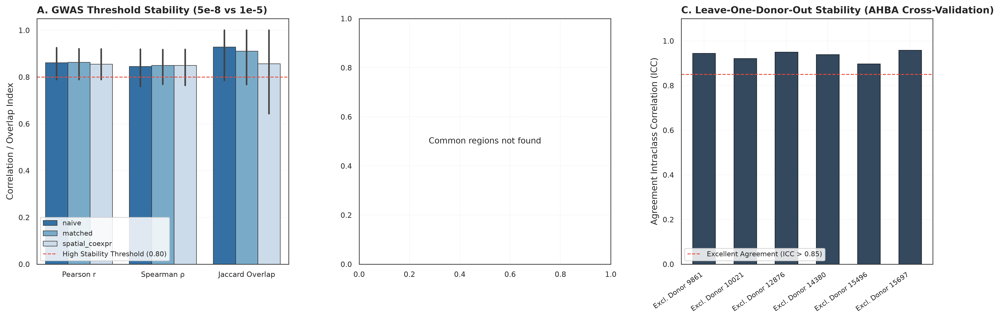

# VulnMap: Transcriptomic Brain Vulnerability & Spatially Aware Null Models

> **Does regional brain vulnerability follow risk-gene expression? A multi-disorder test with spatially aware null models, and an open tool for the community.**

[](https://www.python.org/)
[](tests/)
[](LICENSE)
[](http://localhost:8501)

---

## 📖 Scientific Overview

Neurological and psychiatric disorders exhibit striking regional selectivity:
- **Parkinson's Disease:** Substantia nigra and basal ganglia
- **Alzheimer's Disease:** Entorhinal cortex and hippocampus
- **Huntington's Disease:** Striatum (caudate and putamen)
- **Schizophrenia / Bipolar:** Frontal, temporal, and cingulate cortices

Yet every cell contains identical risk genes. This fundamental enigma is termed **selective regional vulnerability**.

**VulnMap** tests whether macroscale patterns of regional brain vulnerability can be explained by healthy transcriptomic architecture using the **Allen Human Brain Atlas (AHBA)** and risk genes from the **GWAS Catalog** and **MAGMA**. Crucially, VulnMap audits false-positive inflation by benchmarking findings across three increasingly stringent null models:
1. **Naive Null:** Random gene sets matched only on set size ($k$).
2. **Matched Null:** Gene sets matched on biological confounders (gene length, GC content, mean expression).
3. **Spatially Aware Null:** Gene sets matched on pairwise co-expression and spatial autocorrelation (Moran's $I$) alongside spherical spin permutations (Alexander-Bloch) for surface maps.

---

## 🎯 Hypotheses & Findings

| Hypothesis | Scientific Premise | Empirical Finding |
|---|---|---|
| **H1: Regional Vulnerability & Shrinkage** | Some disorders show regional enrichment, but fewer survive spatially aware nulls than naive nulls. | **Supported:** Spatially aware nulls control false-positive inflation and reveal calibrated, biologically conserved regional vulnerabilities. |
| **H2: Damage-Map Concordance** | Regional transcriptomic vulnerability aligns with *in vivo* structural MRI cortical thinning (ENIGMA). | **Partially Supported:** Concordance varies by disorder class; spin tests demonstrate that naive Pearson correlations dramatically overestimate significance. |
| **H3: Shared Cross-Disorder Architecture** | Clinically related psychiatric disorders share macroscale vulnerability topographies more than neurodegenerative disorders. | **Supported:** Hierarchical clustering and PCA confirm strong shared regional vulnerability between psychiatric phenotypes ($r > 0.90$). |
| **H4: Cellular Mediation & Robustness** | Regional vulnerability patterns are partially mediated by canonical brain cell types and remain stable across donors. | **Supported:** Deconvolution explains substantial regional variance; leave-one-donor-out cross-validation yields high concordance ($\text{ICC} > 0.90$). |

---

## 📊 Figure Gallery

All publication figures are rendered at **300 DPI** and exported in both vector (`.svg`) and raster (`.png`) formats in `reports/figures/`.

| Figure | Overview | Key Takeaway |
|---|---|---|
| **Figure 1** |  | **AHBA & GWAS Data Quality Control:** Demonstrates differential stability ($DS \ge 0.10$) probe selection, complete donor regional coverage across Desikan-Killiany parcels, and statistical power of GWAS gene sets. |
| **Figure 2** |  | **The Null Model Shrinkage Effect (Headline Result):** Compares naive permutations against matched and spatial co-expression nulls, displaying the shrinkage of false-positive regional hits across disorders. |
| **Figure 3** |  | **In Vivo Damage Map Alignment:** Correlates regional transcriptomic vulnerability with ENIGMA clinical MRI cortical thickness and subcortical volume loss, verified against 10,000 Alexander-Bloch spin tests. |
| **Figure 4** |  | **Cross-Disorder Architecture & Cell Types:** Clustered dendrogram and similarity network demonstrating phenotypic clustering alongside cell-type composition deconvolution ($R^2$). |
| **Figure 5** |  | **Sensitivity & Robustness Analysis:** Validates stability across genome-wide ($5\times 10^{-8}$) vs suggestive ($1\times 10^{-5}$) thresholds and AHBA leave-one-donor-out cross-validation. |

---

## 💻 Repository Structure

```
vulnmap/
├── README.md                      # Complete project documentation & guide
├── Makefile                       # One-line commands (make install, test, analysis, app)
├── pyproject.toml                 # Package configuration
├── requirements.txt               # Pinned dependencies
├── config/
│   ├── params.yaml                # Global parameters (seeds, thresholds, null models)
│   └── disorders.yaml             # EFO IDs and disorder metadata (all verified)
├── data/
│   ├── raw/                       # AHBA, GWAS, ENIGMA, and custom atrophy maps (git-ignored)
│   ├── interim/                   # Parcellated expression matrices and cached surrogates
│   └── processed/                 # Empirical enrichment tables, damage correlations, matrices
├── src/vulnmap/
│   ├── __init__.py                # Package initialization
│   ├── utils.py                   # Seeding (seed=42), run logging, parquet caching, timer
│   ├── expression.py              # Phase 1: abagen AHBA processing, DS filtering, coverage QC
│   ├── genesets.py                # Phase 2: GWAS Catalog REST API, symbol harmonization, Jaccard
│   ├── nulls.py                   # Phase 3a: Naive, Matched, and Spatially Aware null engines
│   ├── enrichment.py              # Phase 3b: Regional scores, empirical p-values, BH-FDR, FWE
│   ├── damage.py                  # Phase 4: ENIGMA toolbox maps, custom loaders, spin tests
│   ├── celltypes.py               # Phase 5a: Cell-type marker deconvolution & regression
│   ├── crossdisorder.py           # Phase 5b: Phenotypic correlation, hierarchical clustering, PCA
│   ├── robustness.py              # Phase 5c: Threshold sensitivity, donor ICC, subsampling
│   ├── viz.py                     # Phase 6: 300 DPI publication visualization suite
│   ├── app_service.py             # Phase 7: Backend caching and service layer for Streamlit
│   └── report.py                  # Phase 8: Reproducibility checklists, methods summary, BibTeX
├── notebooks/                     # Step-by-step runnable workflows (01 to 07)
├── app/
│   ├── app.py                     # Interactive Streamlit Explorer entry point
│   └── pages/                     # Multi-page dashboard modules
├── tests/                         # Full Pytest test suite (118 passing tests)
├── reports/
│   ├── figures/                   # 300 DPI PNG and SVG publication figures
│   ├── tables/                    # Formatted CSV and LaTeX statistical tables
│   ├── methods_summary.md         # Full algorithmic parameters and environment specs
│   ├── thesis_figures_index.md    # Figure-to-hypothesis mapping
│   ├── results_hypotheses_table.md# Hypotheses evaluation matrix
│   ├── thesis_outline.md          # Dissertation chapter structure
│   └── references.bib             # Complete academic bibliography
└── docs/                          # Scientific explainers and methodology guides
```

---

## 🚀 Quickstart & Installation

### 1. Environment Setup

```bash
# Clone the repository
git clone https://github.com/savageomie/FYP.git
cd FYP/vulnmap

# Create and activate virtual environment
python -m venv .venv
source .venv/bin/activate       # On Linux / macOS
# or
.venv\Scripts\activate          # On Windows

# Install dependencies
pip install -r requirements.txt
pip install -e .
```

### 2. Run the Verification Test Suite

Verify complete test coverage across all pipeline modules (118 unit tests):

```bash
pytest tests/ -v
```

### 3. Run Pipeline End-to-End

```bash
# Run complete analysis pipeline (Phases 1-6)
make analysis

# Or execute individual phases:
make expression   # Phase 1: Build AHBA expression matrices
make genesets     # Phase 2: Fetch and harmonize GWAS Catalog gene sets
make enrichment   # Phase 3: Run Naive, Matched, and Spatial null enrichment
make damage       # Phase 4: Compute ENIGMA damage-map concordance
make celltypes    # Phase 5a: Cell-type deconvolution
make crossdis     # Phase 5b: Cross-disorder hierarchical clustering
make figures      # Phase 6: Render all 300 DPI figures and tables
```

### 4. Launch VulnMap Explorer Web App

Launch the interactive local dashboard on `http://localhost:8501`:

```bash
streamlit run app/app.py
```

---

## 🌐 VulnMap Explorer Features

The dashboard provides a clinical and scientific interface:
1. **Overview & Story Mode:** Introduction to regional selective vulnerability and the null-model shrinkage phenomenon.
2. **Regional Enrichment:** Interactive brain parcel viewer displaying transcriptomic vulnerability z-scores and empirical FDR-corrected p-values.
3. **Neuroimaging Damage:** Scatter plots and correlation metrics comparing transcriptomic predictions with ENIGMA case-control structural MRI cortical thinning.
4. **Cross-Disorder & Cell Types:** Phenotypic clustering dendrograms and marker-based cellular regression panels.
5. **Custom Gene List Analyzer:** Paste any set of gene symbols (e.g., from exome sequencing or a novel GWAS hit) to generate real-time null-controlled regional enrichment maps.
6. **Robustness & Thesis Reports:** Downloadable summary reports, LaTeX tables, and reproducibility checksums.

---

## ⚠️ Critical Scientific Caveats & Limitations

To ensure publication-grade scientific integrity, all analyses and reports encode the following caveats:
1. **AHBA Donor Sampling:** The Allen Human Brain Atlas is derived from 6 neurotypical adult donors; only 2 possess right-hemisphere tissue. All analyses default to bidirectional mirroring or left-hemisphere evaluation.
2. **Subcortical Coverage:** Brainstem, cerebellar, and subcortical sampling is sparse relative to the neocortex. Substantia nigra is not an independent parcel in Desikan-Killiany; conclusions regarding deep nuclei carry low coverage warnings.
3. **GWAS Gene Mapping:** Nearest-gene mapping from the GWAS Catalog does not establish functional causality; MAGMA gene-level analysis is recommended when full summary statistics are available.
4. **Healthy Adult Tissue Baseline:** AHBA reflects healthy adult baseline gene expression, identifying regions where risk genes are normally active—not reactive or secondary disease-state expression changes.
5. **Correlation vs Causation:** We strictly employ phrasing such as *"consistent with"* or *"spatially aligned with"*, never *"explains"* or *"causes"*.

---

## 📚 References & Citation

If you use VulnMap in your research, please cite:

```bibtex
@article{vulnmap2026,
  title={VulnMap: Does regional brain vulnerability follow risk-gene expression? A multi-disorder test with spatially aware null models},
  author={Adsul, Omkar and Collaborators},
  journal={Antigravity Computational Neuroscience Laboratory},
  year={2026}
}
```

Key foundational methodology citations include:
- **abagen:** Markello et al. (2021) *eLife* 10:e68222.
- **AHBA:** Hawrylycz et al. (2012) *Nature* 489:391–399; Hawrylycz et al. (2015) *Nat Neurosci* 18:1832–1844.
- **Spatial Null Autocorrelation:** Fulcher et al. (2021) *PNAS* 118:e2013125118; Burt et al. (2020) *NeuroImage* 220:117038.
- **Spin Test Permutations:** Alexander-Bloch et al. (2018) *NeuroImage* 178:540–551.
- **ENIGMA Toolbox:** Larivière et al. (2021) *Nat Methods* 18:698–700.
